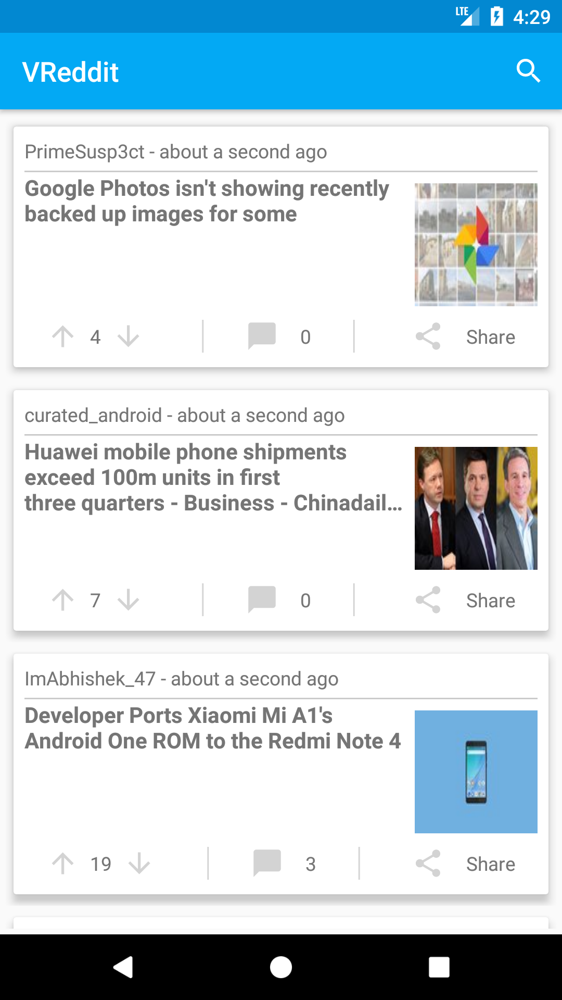
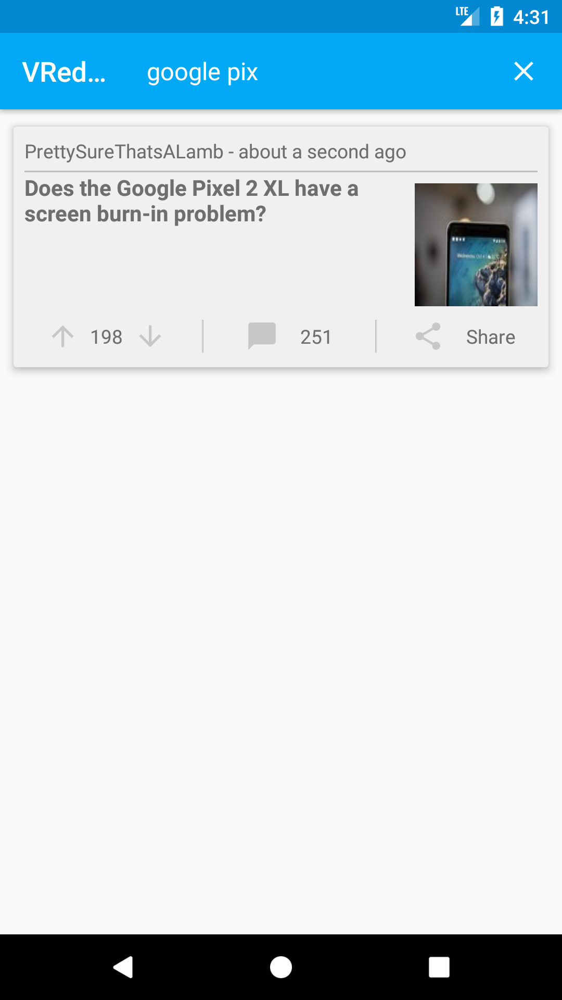
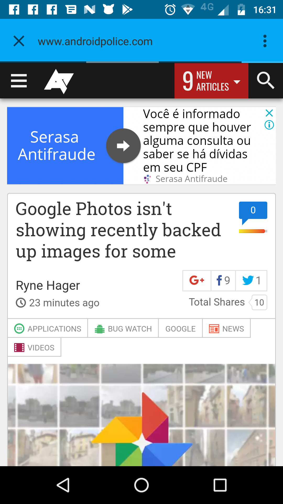
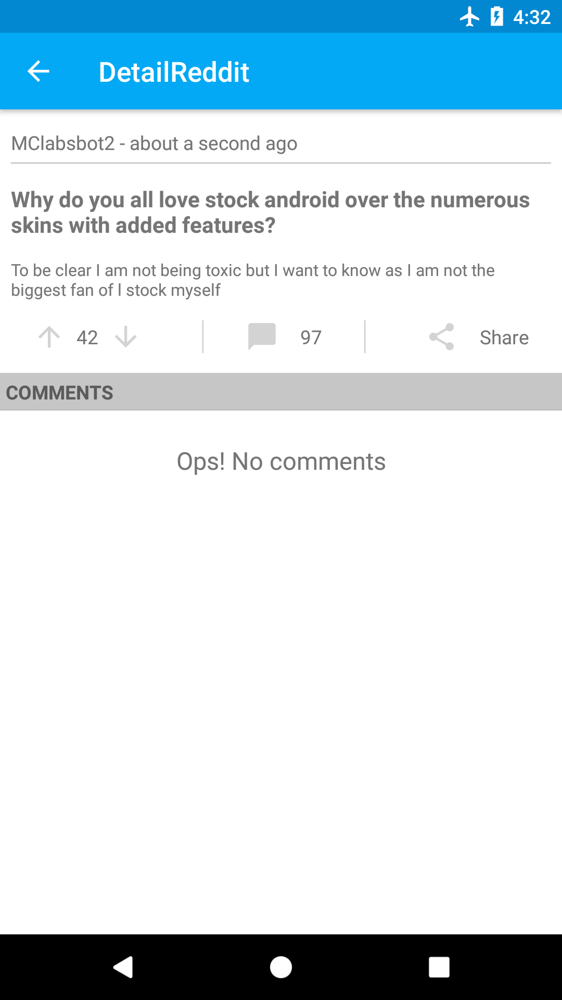
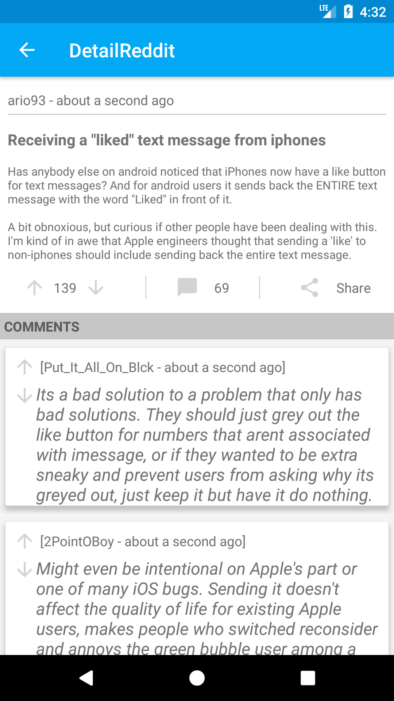
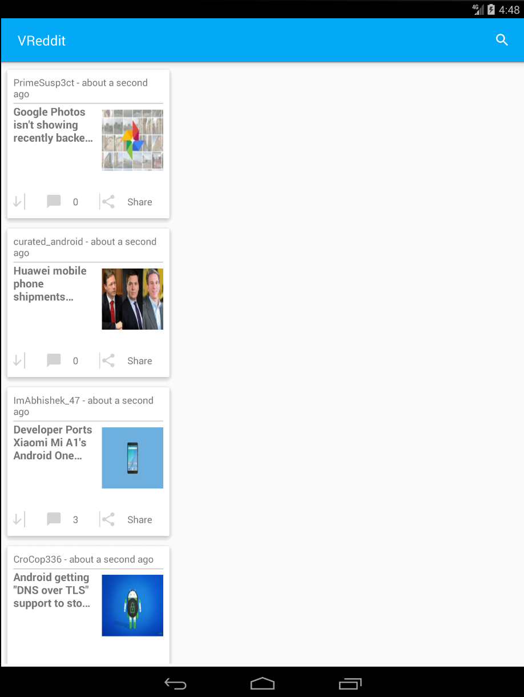
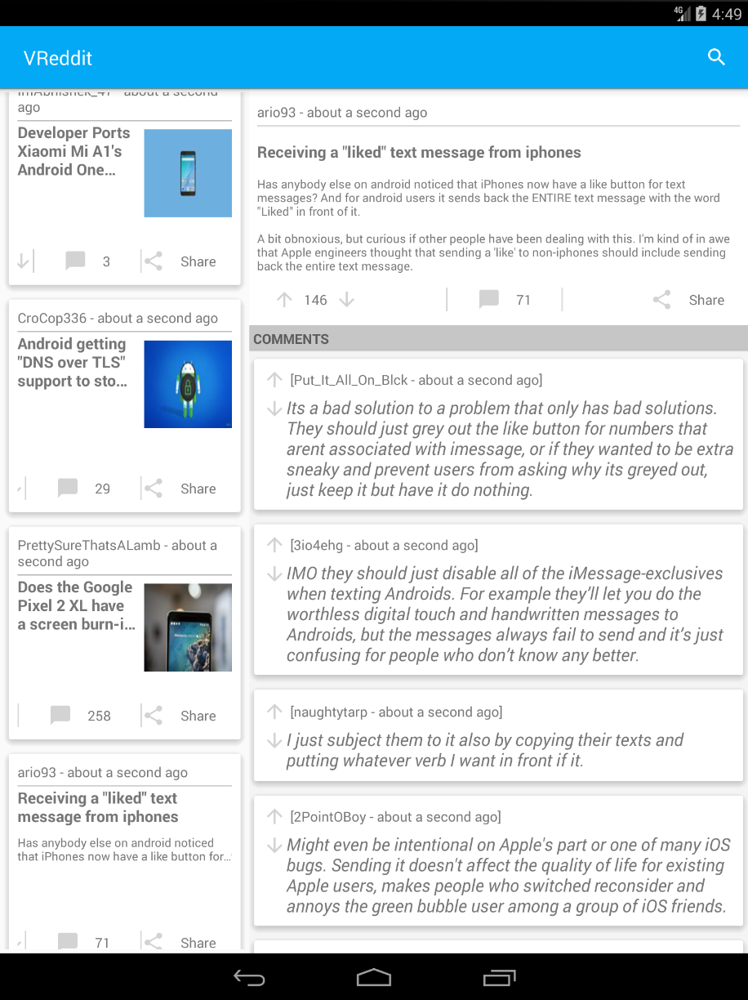

# VReddit

The project has Reddit's theme and use its API https://www.reddit.com/dev/api/

## Table of Contents
* [ScreenShots](#screenshots)
* [Tools and Libs](#tools)
* [TODOs](#todos)

## ScreenShots

  
  
  
  
  
  
  
   
  
  

## Tools and Libs
* [Kotlin](https://kotlinlang.org/)
* [Kotlin Android Extensions](https://kotlinlang.org/docs/tutorials/android-plugin.html)
* [Timber](https://github.com/JakeWharton/timber)
* [RxJava2](https://github.com/ReactiveX/RxJava)
* [Retrofit2](http://square.github.io/retrofit/)
* [Picasso](http://square.github.io/picasso/)
* [Gson](https://github.com/google/gson)
* [Android Support Libs](https://developer.android.com/topic/libraries/support-library/index.html):
  * RecyclerView
  * CardView
  * Design Support Library
  * ConstraintLayout
  * [Custom Labs](https://developer.android.com/topic/libraries/support-library/packages.html#custom-tabs)
* Android Testing Support Libs
  * [Espresso](https://developer.android.com/training/testing/espresso/index.html)
  * [jUnit](http://junit.org/junit4/)
* [Room Components](https://developer.android.com/topic/libraries/architecture/room.html)
* [Stetho](http://facebook.github.io/stetho/)
* [Fabric](https://get.fabric.io/?utm_campaign=discover&utm_medium=natural)
* [Jacoco](https://github.com/arturdm/jacoco-android-gradle-plugin)

## ToDos
* To improve layout of the list.
* To do test with Roboeletric
* More more more test much more

License
-------

    Copyright 2017 Rodrigo Vianna

    Licensed under the Apache License, Version 2.0 (the "License");
    you may not use this file except in compliance with the License.
    You may obtain a copy of the License at

    http://www.apache.org/licenses/LICENSE-2.0

    Unless required by applicable law or agreed to in writing, software
    distributed under the License is distributed on an "AS IS" BASIS,
    WITHOUT WARRANTIES OR CONDITIONS OF ANY KIND, either express or implied.
    See the License for the specific language governing permissions and
    limitations under the License.
